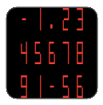
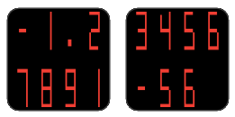
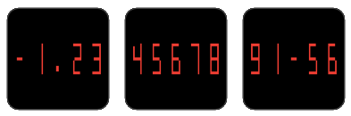
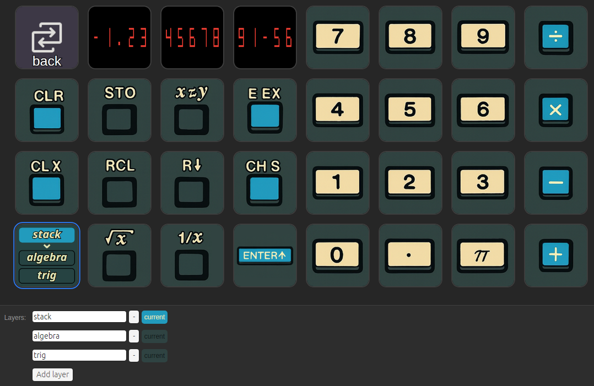
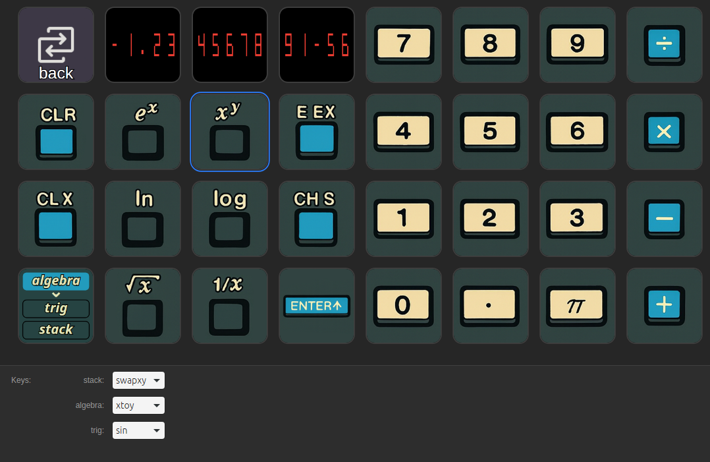

# An HP-35 emulator for Stream Deck

This Stream Deck plugin provides actions that emulate the functionality of the
original [HP-35](https://en.wikipedia.org/wiki/HP-35) calculator.
The HP-35 was the world's first pocket scientific calculator, released by
Hewlett-Packard in 1972.

Note that the HP-35 (and this plugin) use
[Reverse Polish notation](https://en.wikipedia.org/wiki/Reverse_Polish_notation).
If you are accustomed to the more common algebraic / infix notation, this will
take some time to get used to.

## Actions
The plugin includes 35 actions that correpsond to each of the keys on the HP-35,
plus 4 additional actions to help you create a usable calculator profile
on your Stream Deck. Note that you'll need a minimum of 15 buttons on your
Stream Deck to get a usable calculator, and 20 or more buttons is highly
recommended. A Stream Deck XL or equivalent is ideal.
The 35 actions that correspond to the calculator keys are fully described
in the [HP35 manual from hpcalc.org](https://literature.hpcalc.org/community/hp35-om-en-reddot.pdf).
The plugin faithfully reproduces the behavior of the keys, even when
that behavior seems somewhat quirky. The 4 additional actions are described below.

Special thanks to Veniamin Ilmer and his excellent 
[online HP35 hardware simulator](https://veniamin-ilmer.github.io/hp35/).
It was a great help in understanding specific behaviors of the HP-35 when the
manual was missing details.

### Display
The "Display" action is used to tell the plugin which button(s) on the Stream Deck
should be used as the calculator display. The HP-35 had a 15-position display:

- 1 position on the far left to indicate the sign of the result
- 11 positions to hold the mantissa of the value. Note that the decimal point
  is always shown and consumes one of these positions, leaving 10 positions
  to display significant digits. Unlike most modern calculators, the HP-35
  always displayed the mantissa left-justified.
- 1 position to show the sign of the exponent. For positive exponents this
  position is blank.
- 2 positions to show the exponent of the value.

The Display action can be assigned to multiple buttons. The plugin automatically
detects whether the action has been assigned to 1, 2, or 3 horizontally
adjacent buttons and adjusts the display to make use of the available space.

For example, the value $`-1.234567891\times 10^{-56}`$ would be displayed:

| number of buttons | |
| ---------- | ---------- |
| single button  |  |
| two horizontally adjacent buttons |  |
| three horizontally adjacent buttons |  |

### Layers and Multikey
All 35 keys on the HP-35 obviously cannot fit on most (any?) Stream Decks.
To help you create a more usable profile, this plugin has the notion of
layers. A layer is a logical construct that can be used to change which
calculator actions are displayed on one or more buttons of your Stream Deck.

To use layers you'll first need to assign the "Next layer" and/or
the "Previous layer" action to buttons on your Stream Deck. The property
inspectors for these actions allow you to create, delete, and rename layers
for the plugin. The button for the action will display the current layer
with a blue background and other layers with a dark gray background.
The off-white arrow indicates which layer will become the current layer
when the button is pressed.
Note that the button only displays the names of the current layer
plus two additional layers. If you have more than three layers defined
they will be displayed as you change the current layer.
Here, for example, here is a profile where the "Next layer" action has been
assigned to the bottom left button on a Stream Deck XL. In the property
inspector for the button you can see that there are 3 layers defined,
named "stack", "algebra", and "trig".

Assign the "Multikey" action to button(s) whose behavior should change
based on the current layer. By default, a Multikey button shows a blank
key for each layer. Pressing a Multikey button that is blank has no effect.
The Multikey property inspector allows you to assign different actions to
the button for each of the layers currently defined. All 35 of the HP-35
calculator keys plus a "(blank)" key are available for assignment.
The Multikey button's display automatically updates to show the image
for the calculator key assigned to the current layer.
Use the property inspector for the "Next layer" or
"Previous layer" actions to add, remove, or rename layers.
Continuing the example above, this screenshot shows a Multikey action
assigned to the 3rd button in the 2nd row. The property inspector shows the
following assignments for the button:

| layer | action/key |
| ----- | ----- |
| stack | swapxy |
| algebra | xtoy |
| trig | sin |

The current layer is "algebra" (shown on the bottom left button), so the
multikey is acting as an $`x^y`$ action.

## Installation
